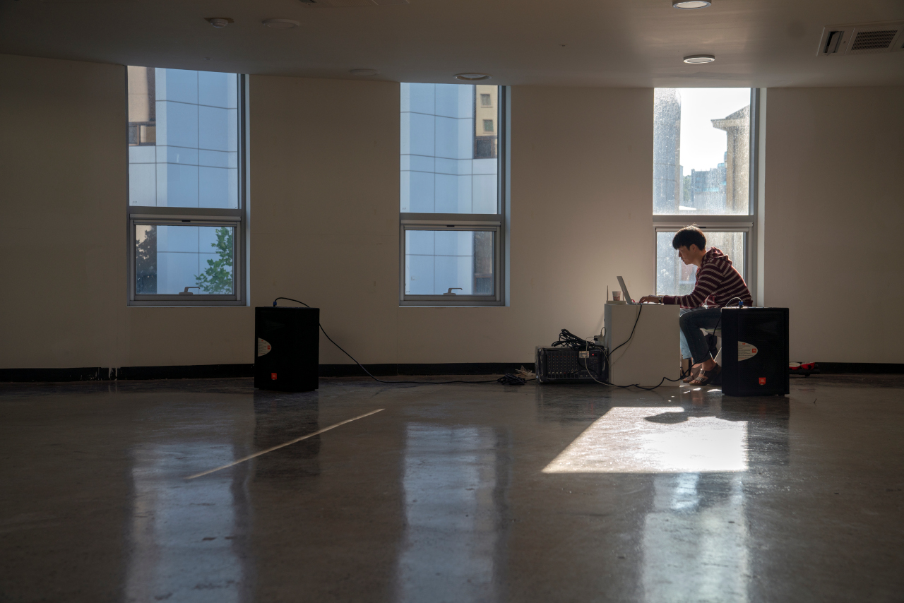
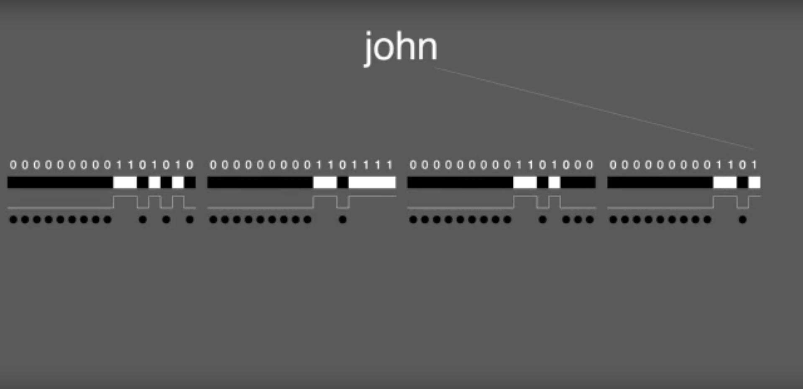

<!-- <link rel="stylesheet" type="text/css" href="style.css"/> -->
[weatherreport](https://weatherrep0rt.github.io/){:target="_blank"} |
[instagram](https://www.instagram.com/giy.eyear/){:target="_blank"} |
[bandcamp](https://thisriver.bandcamp.com/){:target="_blank"} |
[soundcloud](https://soundcloud.com/thisriver){:target="_blank"} |
[self-taught](https://morfant.github.io/self-taught/){:target="_blank"} |
[openprocessing](https://www.openprocessing.org/user/139857/#sketches){:target="_blank"}

    

합창 (2019) /w Jiyeon Kim, Mihye Cha (as jeokdo)

피아노데이 PianoDay (2019)    

캐치볼, 캐치밤 Catch ball, catch bomb (2018)

photo by 이야기
  
  
  
메이저리그 Majorleague (2018)
  

사운드캠프 Soundcamp (2018)
  
photo by euina jeong  

이름 이진수변환 및 열전사프린팅 Name to binarary visualizer and thermal printing installation (2018)  
  
